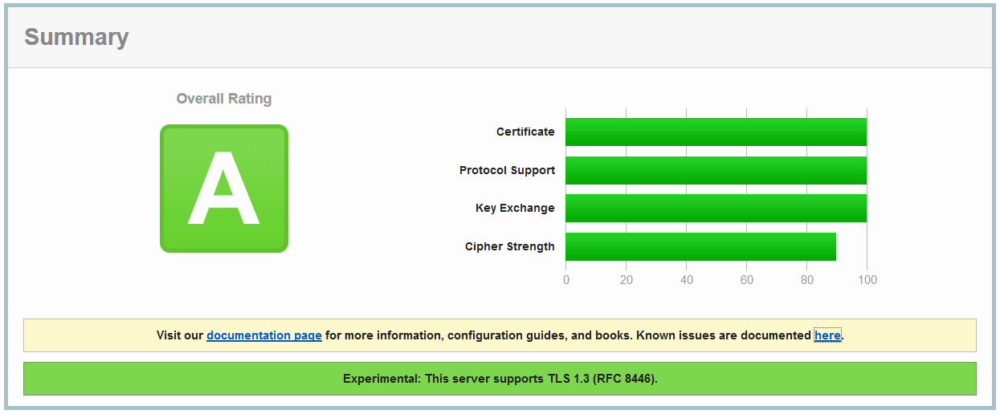

# jschnabel/docker-nginx


[](https://hub.docker.com/r/jschnabel/nginx)
[](https://github.com/joshua-schnabel/docker-nginx/actions?query=workflow%3Adocker)
[](https://hub.docker.com/r/jschnabel/nginx)
[](https://github.com/joshua-schnabel/docker-nginx/blob/main/LICENSE)
[](https://github.com/joshua-schnabel/docker-nginx/issues)

___A lightweight, pre-configured nginx container with HTTP/2, TLS 1.3 and SSL Labs A rating___

Current Version:
[](https://hub.docker.com/r/jschnabel/nginx/tags)
[](https://hub.docker.com/r/jschnabel/nginx/tags)
[](https://github.com/joshua-schnabel/docker-nginx/actions?query=branch%3Amain+workflow%3Adocker)
[](https://github.com/joshua-schnabel/docker-nginx/commits/main)

Development Version:
[](https://hub.docker.com/r/jschnabel/nginx/tags)
[](https://hub.docker.com/r/jschnabel/nginx/tags)
[](https://github.com/joshua-schnabel/docker-nginx/actions?query=branch%3Adev+workflow%3Adocker)
[](https://github.com/joshua-schnabel/docker-nginx/commits/dev)

- Built on lightweight and secure Alpine Linux
- Very small Docker image footprint
- Optimized for static and reverse-proxied content
- Secure TLS defaults (HTTP/2, TLS 1.3)
- GDPR-friendly log rotation preconfigured

## What is nginx?

> Nginx is a web server which can also be used as a reverse proxy, load balancer, mail proxy and HTTP cache. (Wikipedia)

## Why would you use this image?

With this image you get a preconfigured nginx image. This image provides support for TLS 1.3 and HTTP 2.0. 

A secure TLS protected server is started without having to change the configuration. A self-signed certificate is created for this purpose. SSL Labs rates the configuration with an A.



## Quick start

### Minimal HTTP and HTTPS:

```bash
docker run -d \
  -p 80:8080 \
  -p 443:8443 \
  jschnabel/nginx:latest
```

### With Compose:

```yml
services:
  nginx:
    image: jschnabel/nginx:latest
    container_name: nginx
    ports:
      - "80:8080"
      - "443:8443"
```

Open your IP/domain in a browser — you should see the test page.

## Example Usages

### Serve static content

```yml
services:
  nginx:
    image: jschnabel/nginx:latest
    ports:
      - "80:8080"
      - "443:8443"
    volumes:
      - /media/docker/nginx/webroot:/application/data/webroot
```

### Custom configurations

All `.conf` files from `/application/data/sites-enabled` and `/application/data/streams` are loaded.

```yml
services:
  nginx:
    image: jschnabel/nginx:latest
    ports: ["80:8080", "443:8443"]
    volumes:
      - /media/docker/nginx/webroot:/application/data/webroot
      - /media/docker/nginx/sites:/application/data/sites-enabled
      - /media/docker/nginx/streams:/application/data/streams
```

Example site (HTTP->HTTPS redirect + TLS):

```nginx
server {
  listen 8080;
  listen [::]:8080;
  server_name <your.domain>;
  return 301 https://$host$request_uri;
}

server {
  listen 8443 ssl http2;
  listen [::]:8443 ssl http2;
  server_name <your.domain>;

  ssl_certificate     /application/data/certs/<your.domain>.pem;
  ssl_certificate_key /application/data/certs/<your.domain>.key;

  include /application/config/snippets/gzip.conf;
  include /application/config/snippets/header.conf;
  include /application/config/snippets/tls.conf;

  location / {
    root  /application/data/webroot/<your.domain>;
    index index.html index.htm;
    try_files $uri $uri/ $uri.html $uri.htm =404;
  }
}
```

Example stream:

```nginx
stream {
  upstream mqtt { server mosquitto:1883; }

  server {
    listen 8883 ssl;
    proxy_pass mqtt;
    ssl_certificate     /application/data/certs/default_cert.pem;
    ssl_certificate_key /application/data/certs/default_key.pem;
    include /application/config/snippets/tls_stream.conf;
  }

  server { listen 1883; proxy_pass mqtt; }
}
```

### Authentication (Basic Auth)

Include the snippet and create a user:

```nginx
location / {
  include /application/config/snippets/basic_auth.conf;
  root /application/data/webroot/<your.domain>;
  index index.html index.htm;
}
```

```bash
docker exec -it nginx /application/config/scripts/addUser.sh /application/data/passwords/htpasswd
```

### WebDAV

```nginx
location / {
  include /application/config/snippets/basic_auth.conf;
  include /application/config/snippets/webdav.conf;
}
```

### Reverse proxy example (with WebSocket)

```nginx
upstream app_backend { server app:3000; }

server {
  listen 8443 ssl http2;
  server_name example.com;

  ssl_certificate     /application/data/certs/example.com.pem;
  ssl_certificate_key /application/data/certs/example.com.key;

  include /application/config/snippets/tls.conf;
  include /application/config/snippets/header.conf;

  location /api/ {
    proxy_pass http://app_backend;
    include /application/config/snippets/proxy.conf;
    include /application/config/snippets/proxy_websocket.conf;
  }
}
```

## TLS/SSL modes and ACME

The entrypoint supports three modes (environment variables in parentheses):

- Off: HTTP only (TLS_MODE=off)
- Custom: use existing certificates under `/application/data/certs` (TLS_MODE=custom)
- ACME: automatic certificates via Let’s Encrypt (TLS_MODE=acme)

Additional variables for ACME/behavior:

- FORCE_TLS=true|false — enforce HTTP→HTTPS redirect
- ACME_MAIL=you@example.com — required for TLS_MODE=acme
- ACME_SERVER=letsencrypt|… — ACME CA selection (default: letsencrypt)
- ACME_ECC=true|false — ECDSA certificates (default: true)
- ACME_KEYLENGTH=ec-256|ec-384|3072|4096 — key length (default: ec-384)
- OUTPUT_FORMAT=human|json — entrypoint log format

## Configuration options

### Environment variables (runtime)

| Variable        | Values                              | Default     | Required | Description                                      |
|-----------------|-------------------------------------|-------------|----------|--------------------------------------------------|
| TLS_MODE        | off, custom, acme                   | off         | No       | TLS mode (off=HTTP only; custom=use local certs; acme=Let’s Encrypt) |
| FORCE_TLS       | true, false                         | false       | No       | Force HTTP→HTTPS redirect                        |
| OUTPUT_FORMAT   | human, json                         | human       | No       | Entrypoint log format                            |
| ACME_MAIL       | email address                       | —           | Yes (acme) | Account email for ACME                           |
| ACME_SERVER     | letsencrypt, …                      | letsencrypt | No       | ACME CA server                                   |
| ACME_ECC        | true, false                         | true        | No       | Use ECDSA (true) or RSA (false)                  |
| ACME_KEYLENGTH  | ec-256, ec-384, 3072, 4096          | ec-384      | No       | Key length (use 3072/4096 for RSA)              |

### Container ports

| Port | Purpose                 | Expose externally |
|------|-------------------------|-------------------|
| 8080 | HTTP default server     | If needed         |
| 8443 | HTTPS default server    | Yes               |
| 4444 | Health/Metrics (internal)| No                |


### Data directory layout (from data-fs → /application/data)

On startup the container copies the initial skeleton from `/application/data-fs` into `/application/data`. Use the directories below for your persistent configuration and content.

| Directory                               | What to put here / Purpose                                                                 |
|-----------------------------------------|---------------------------------------------------------------------------------------------|
| /application/data/certs                 | TLS certificates and private keys (`*.pem`, `*.key`). ACME-issued certs also land here. ACME state under `/application/data/certs/acmesh/{config,certs,ca}`. |
| /application/data/dhparams              | Diffie-Hellman parameters (file `dhparam4096.dh` is auto-generated if missing).            |
| /application/data/locations             | Optional per-site include snippets; defaults include this path in server blocks.          |
| /application/data/logs                  | Nginx access/error logs (rotated by cron/logrotate).                                       |
| /application/data/passwords             | Basic Auth files, e.g. `htpasswd` (managed by `/application/config/scripts/addUser.sh`).   |
| /application/data/sites-enabled         | HTTP server blocks (`*.conf`) loaded by nginx.                                             |
| /application/data/streams               | Stream (TCP) configs (`*.conf`) loaded by nginx.                                           |
| /application/data/webdav                | Storage root when enabling the WebDAV snippet.                                             |
| /application/data/webroot               | Static web content. ACME webroot challenges live under `/.well-known/acme-challenge/`.     |


## Logs

Access and error logs are under `/application/data/logs`. Logrotate is configured and runs via cron inside the container.

## Better SSL Labs grade

- 100% Key Exchange: choose RSA 4096 or ECDSA P-384 (ACME_ECC=true and ACME_KEYLENGTH=ec-384)
- 100% Cipher Strength: include `tls_strong.conf` (warning: very old clients will be excluded)

```nginx
include /application/config/snippets/tls_strong.conf;
```


## Disable TLS

Set `TLS_MODE=off` and optionally only publish port 80.

```yml
services:
  nginx:
    image: jschnabel/nginx:latest
    environment:
      - TLS_MODE=off
    ports:
      - "80:8080"
```

## Security

This image is hardened by default (non-root user 1001, restricted paths). To run it as securely as possible:

- Use a read-only root filesystem and only the tmpfs mounts required
- Drop all Linux capabilities, add back only NET_BIND_SERVICE
- Enable no-new-privileges
- Expose only the ports you need — do not publish port 4444
- Configure ulimits for nproc/nofile and cap log size

Hardened docker-compose example:

```yml
services:
  nginx:
    image: jschnabel/nginx:latest
    container_name: nginx-secure
    restart: unless-stopped
    ports:
      - "80:8080"
      - "443:8443"
    environment:
      - TLS_MODE=acme
      - FORCE_TLS=true
      - ACME_MAIL=your-email@example.com
      - ACME_SERVER=letsencrypt
      - ACME_ECC=true
      - ACME_KEYLENGTH=ec-384
      - OUTPUT_FORMAT=human
    volumes:
      - ./data:/application/data:rw
    security_opt:
      - no-new-privileges:true
    cap_drop: ["ALL"]
    cap_add: ["NET_BIND_SERVICE"]
    read_only: true
    tmpfs:
      - /application/run:size=2M,uid=1001,gid=1001,mode=0770,noexec,nosuid,nodev
      - /application/tmp:size=32M,uid=1001,gid=1001,mode=0770,noexec,nosuid,nodev
      - /var/lib/nginx/logs:size=8M,uid=1001,gid=1001,mode=0755,noexec,nosuid,nodev
      - /application/bin/acmesh/ca/:size=8M,uid=1001,gid=1001,mode=0755,noexec,nosuid,nodev
    ulimits:
      nproc: 65535
      nofile:
        soft: 20000
        hard: 40000
    logging:
      driver: json-file
      options:
        max-size: "10m"
        max-file: "3"
```

Tips:

- Only mount `/application/data`; do not mount system paths
- Put custom sites/streams under `/application/data/sites-enabled` and `/application/data/streams`
- Sensitive files (keys) are restricted to user 1001 by default

## Upgrade notes (older releases → 1.3.x)

- Paths migrated from `/media/...` to `/application/...` — update volumes accordingly
- Internal ports are 8080/8443 (instead of 80/443). Host ports remain freely mappable
- ACME is integrated — legacy Certbot/standalone ACME instructions are optional

## Image tags & architectures

| Tag          | Purpose                | Branch | Architectures                         |
|--------------|------------------------|--------|---------------------------------------|
| latest       | Stable release         | main   | linux/amd64, linux/arm64, linux/arm/v7|
| latest-dev   | Development snapshot   | dev    | linux/amd64, linux/arm64, linux/arm/v7|
| versioned    | Pinned release (e.g. version-1.3.0) | tags | linux/amd64, linux/arm64, linux/arm/v7 |

## Snippet catalog

| Snippet                      | Use for                                        |
|------------------------------|------------------------------------------------|
| gzip.conf                    | Enable gzip for common types                   |
| header.conf                  | Secure headers and server_tokens off           |
| caching_map.conf             | Cache control mappings                         |
| caching_header.conf          | Conditional caching headers                    |
| ratelimit.conf               | Default request rate limiting                  |
| ratelimit_high.conf          | Stricter request rate limiting                 |
| proxy.conf                   | Reverse proxy defaults (timeouts, buffers)     |
| proxy_websocket.conf         | WebSocket upgrade and proxy headers            |
| fastcgi.conf                 | FastCGI defaults                               |
| tls.conf                     | Modern TLS config (balanced compatibility)     |
| tls_strong.conf              | Strong TLS ciphers only (drops legacy clients) |
| tls_stream.conf              | TLS for stream{} servers                       |
| tls_stream_strong.conf       | Strong TLS for stream{}                        |
| webdav.conf                  | WebDAV locations and methods                   |
| basic_auth.conf              | HTTP Basic authentication                      |


## ACME notes

- Uses HTTP-01 via webroot under `/application/data/webroot/<server_name>/.well-known/acme-challenge/`.
- For testing rates/limits use the staging CA: `ACME_SERVER=letsencrypt_test`.
- Certificates are grouped per server block by its `server_name` list. Use separate site files if you need different cert groupings.
- Do not block `/.well-known/acme-challenge/` in custom locations.

