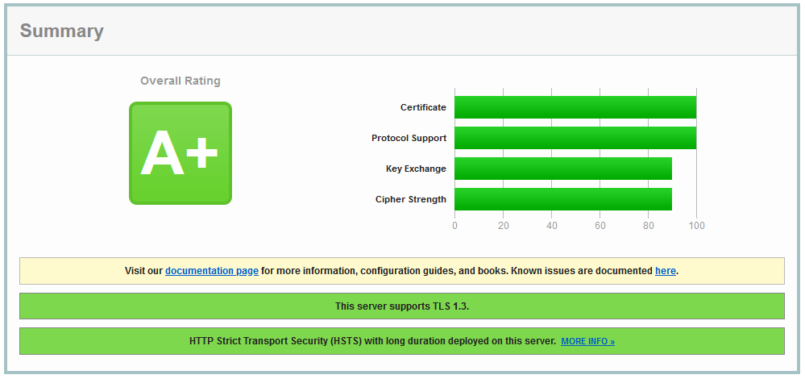

# jschnabel/docker-nginx


[](https://hub.docker.com/r/jschnabel/nginx) 
[](https://github.com/joshua-schnabel/docker-nginx/actions?query=workflow%3Adocker)
[](https://hub.docker.com/r/jschnabel/nginx) 
[](https://github.com/joshua-schnabel/docker-nginx/blob/master/LICENSE) 
[](https://github.com/joshua-schnabel/docker-nginx/issues)

 ___A lightweight, pre-configured nginx container with HTTP 2.0, TLS1.3 and SSL Labs A rating___
 
Current Version: 
[](https://hub.docker.com/r/jschnabel/nginx/tags)
[](https://hub.docker.com/r/jschnabel/nginx/tags) 
[](https://github.com/joshua-schnabel/docker-nginx/actions?query=branch%3Amaster+workflow%3Adocker)
[](https://github.com/joshua-schnabel/docker-nginx/commits/master)


Development Version: 
[](https://hub.docker.com/r/jschnabel/nginx/tags)
[](https://hub.docker.com/r/jschnabel/nginx/tags) 
[](https://github.com/joshua-schnabel/docker-nginx/actions?query=branch%3Adev+workflow%3Adocker)
[](https://github.com/joshua-schnabel/docker-nginx/commits/dev)


 * Built on the lightweight and secure Alpine Linux distribution
 * Very small Docker image size (+/- 8MB)
 * Optimized for rapid delivery of static content and proxied content from downstream web applications.
 * Secure configuration with pre-configured, optimized TLS settings
 * Pre-defined DSGVO-compliant log rotation settings with 7-day retention of access logs.

## What is nginx?

> Nginx is a web server which can also be used as a reverse proxy, load balancer, mail proxy and HTTP cache. (_Wikipedia_)

## Why would you use this image?

With this image you get a preconfigured nginx image. This image provides support for TLS 1.3 and HTTP 2.0. 

A secure TLS protected server is started without having to change the configuration. A self-signed certificate is created for this purpose. SSL Labs rates the configuration with an A.



## Setup

The easiest way to start the server is the following command.

```bash
docker run -d -p 80:80 -p 443:443 jschnabel/nginx
```

You can also use docker-compose.

```yml
services:
   nginx:
     image: jschnabel/nginx
     container_name: nginx
     ports:
       - 80:80
       - 443:443
```

If now the IP address or domain is accessed with the browser, the test page should be visible.

### Hosting some simple static content

To be able to host your own content, just mount a directory under `/media/data/webroot`. 

```yml
services:
   nginx:
     image: jschnabel/nginx
     container_name: nginx
     ports:
       - 80:80
       - 443:443	 
     volumes:
       - /media/docker/volumes/nginx/webroot:/media/data/webroot
```

In this example all data from the host directory `/media/docker/volumes/nginx/webroot` will be published as content.

### Custom SSL Certificate

The configuration shown above will cause a warning window in all browsers. This is due to the self-signed certificate. 
To get a free certificate from Let's Encrypt you have to do the following. First the certbot must be installed on the host. 
Then a certificate can be created using the command below. Please make sure that a directory is mounted by the host as webroot.

#### ACME.sh

```bash
acme.sh --issue -d <your.domain> --cert-file /media/docker/volumes/nginx/webroot/cert.pem --key-file /media/docker/volumes/nginx/webroot/key.pem --fullchain-file /media/docker/volumes/nginx/webroot/fullchain.pem --reloadcmd "docker restart nginx"
```

The program will create the following files.

```
/media/docker/volumes/nginx/webroot/cert.pem 
/media/docker/volumes/nginx/webroot/key.pem
/media/docker/volumes/nginx/webroot/fullchain.pem
```

Now the certificate and the private key have to be mounted. 

```yml
services:
   nginx:
     image: jschnabel/nginx
     container_name: nginx
     ports:
       - 80:80
       - 443:443	 
     volumes:
       - /media/docker/volumes/nginx/webroot:/media/data/webroot
       - /etc/letsencrypt/live/<your.domain>/fullchain.pem:/media/data/certs/default_cert.pem:ro
       - /etc/letsencrypt/live/<your.domain>/privkey.pem:/media/data/certs/default_key.pem:ro
```

#### Certbot

```bash
certbot certonly --webroot --webroot-path /media/docker/volumes/nginx/webroot --rsa-key-size 4096 --renew-by-default -d <your.domain>
```

The program will create the following files.

```
/etc/letsencrypt/live/<your.domain>/fullchain.pem
/etc/letsencrypt/live/<your.domain>/privkey.pem
```

Now the certificate and the private key have to be mounted. 

```yml
services:
   nginx:
     image: jschnabel/nginx
     container_name: nginx
     ports:
       - 80:80
       - 443:443	 
     volumes:
       - /media/docker/volumes/nginx/webroot:/media/data/webroot
       - /etc/letsencrypt/live/<your.domain>/fullchain.pem:/media/data/certs/default_cert.pem:ro
       - /etc/letsencrypt/live/<your.domain>/privkey.pem:/media/data/certs/default_key.pem:ro
```


### Custom Config

In order to provide own configurations, these must be simply mounted under the directory `/media/data/sites-enabled`. 
All configurations from this directory are activated. In this way several domains can be configured.

```yml
services:
   nginx:
     image: jschnabel/nginx
     container_name: nginx
     ports:
       - 80:80
       - 443:443	 
     volumes:
       - /media/docker/volumes/nginx/webroot:/media/data/webroot
       - /etc/letsencrypt/live/<your.domain>/fullchain.pem:/media/data/certs/default_cert.pem:ro
       - /etc/letsencrypt/live/<your.domain>/privkey.pem:/media/data/certs/default_key.pem:ro
       - /media/docker/volumes/nginx/sites:/media/data/sites-enabled
       - /media/docker/volumes/nginx/streams:/media/data/streams
```

A custom site configuration could look like this. It should be mounted to `media/data/sites-enabled`.

```nginx
server {
	listen 80;
	listen [::]:80;
	server_name <your.domain>; 
	
	return 301 https://$host$request_uri;
}

server {
	listen 443 ssl http2;
	listen [::]:443 ssl http2;
	server_name <your.domain>; 
	
	ssl_certificate	 /media/data/certs/<your.domain>.pem;
	ssl_certificate_key /media/data/certs/<your.domain>.pem;

	include /media/data/snippets/gzip.conf;
	include /media/data/snippets/header.conf;
	include /media/data/snippets/tls.conf;
	
	location / {
		root   /media/data/webroot/<your.domain>;
		index  index.html index.htm;
	}

	error_page   500 502 503 504  /50x.html;
	location = /50x.html {
		root   /media/data/webroot/<your.domain>;
	}
}
```

A custom stream configuration could look like this. It should be mounted to `media/data/streams`.

```
stream {
    upstream mqtt {
         server mosquitto:1883;
    }

    server {
        listen                8883 ssl;
        proxy_pass            mqtt;

        ssl_certificate  /media/data/certs/default_cert.pem;
        ssl_certificate_key /media/data/certs/default_key.pem;

        include /media/data/snippets/tls_stream.conf;
    }

    server {
        listen                1883;
        proxy_pass            mqtt;
    }

}
```

### Log files

The log files (error and access log) are stored under `/media/data/logs` by default. This directory can be mounted for external processing of the log files.

### How to get a better SSL Labs Grade

If you want a better grade at SSL Labs, the following things have to be done. 

#### Key Exchange 100% 

To get a 100% rating in the Key Exchange category it is necessary to use a 4096 bit RSA certificate or an ECDSA certificate with ECDSA P-384 or ECDSA P-521.

With acme.sh you can create such a certificate with 4096 bit RSA if you add the following parameter to the command. 

```bash
acme.sh --issue --keylength 4096 ..."
```

To get an ECDSA P-384 certificate the command must be modified as follows. 

```bash
acme.sh --issue --ecc --keylength ec-384 ..."
```

Certbot currently does not support ECDSA certificates. However a 4096 bit RSA can be created. Therefore the key length has to be provided.

```bash
certbot certonly --rsa-key-size 4096 ...
```


#### Cipher Strength 100%

To get 100% in this discipline no cipher suites with 128bit are allowed in the list of cipher suites. A snippet is provided for this purpose. This snippet must be included as shown in the configuration below. 

WARNING: This will prevent very old clients from accessing your website (e.g. Java <= 7 or Android <= 6). If you expect clients that fall into this category, I advise against using them.  

A custom site configuration could look like this. It should be mounted to `media/data/sites-enabled`.

```nginx
server {
	listen 80;
	listen [::]:80;
	server_name <your.domain>; 
	
	return 301 https://$host$request_uri;
}

server {
	listen 443 ssl http2;
	listen [::]:443 ssl http2;
	server_name <your.domain>; 
	
	ssl_certificate	 /media/data/certs/<your.domain>.pem;
	ssl_certificate_key /media/data/certs/<your.domain>.pem;

	include /media/data/snippets/gzip.conf;
	include /media/data/snippets/header.conf;
	include /media/data/snippets/tls_strong.conf;
	
	location / {
		root   /media/data/webroot/<your.domain>;
		index  index.html index.htm;
	}

	error_page   500 502 503 504  /50x.html;
	location = /50x.html {
		root   /media/data/webroot/<your.domain>;
	}
}
```


## How to disable TLS?

Simply add an environment variable named `DISABLETLS` to the container. The value must be `true`.

```yml
services:
   nginx:
     image: jschnabel/nginx
     container_name: nginx
     environment:
       - DISABLETLS="true"
     ports:
       - 80:80
     volumes:
       - /media/docker/volumes/nginx/webroot:/media/data/webroot
```
